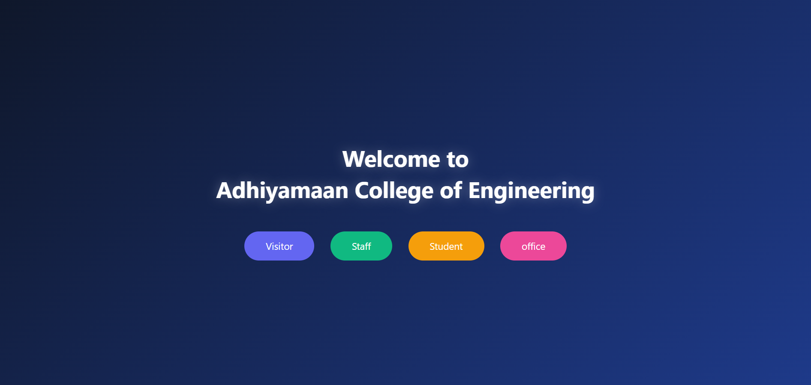
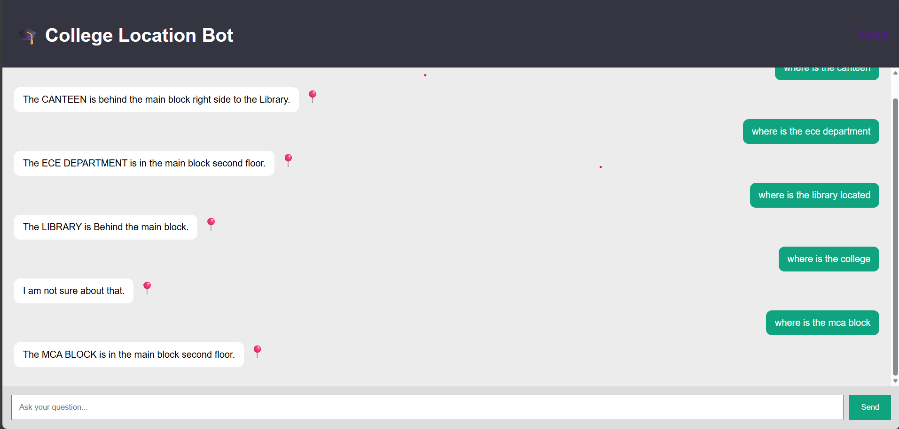
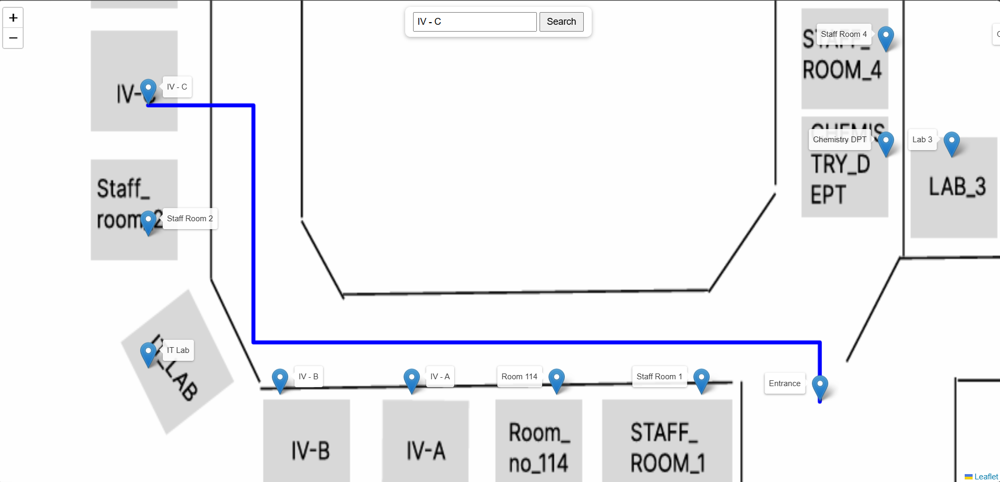
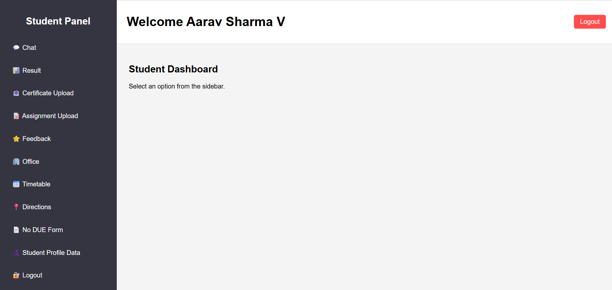
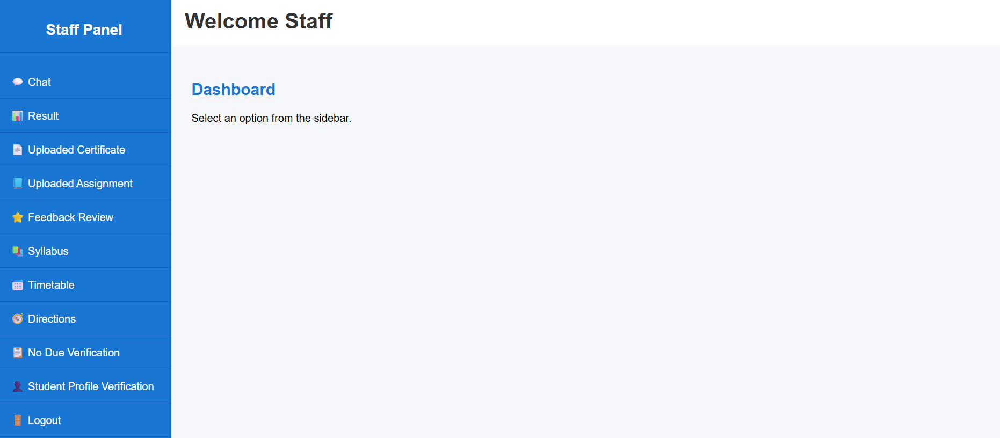

# 🎓 Campus Mate – AI-Powered College Management System

Campus Mate is a Django-based web application that helps manage college academic and administrative activities using an AI chatbot and digital workflows.

---

## 🚀 Features

- AI Chatbot for student queries  
- Student navigation system (assignments, results)  
- No-Due verification system (digital approval process)  
- Centralized college management platform  

---

## 🛠️ Tech Stack

- Python  
- Django  
- HTML, CSS, JavaScript  
- SQLite  

---
## 📸 Screenshots

### Home Page


### AI Chatbot


### Navigation Page


### Student Dashboard


### Staff Dashboard



---

## ⚙️ How to Run

```bash
python manage.py runserver
---

## 👩‍💻 Author

Gayathri P